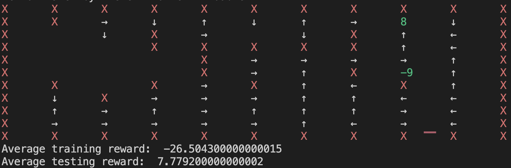

# Gridworld

Yes, this is RL stuff. Ripoff frozen lake

## How to run this?

### Requirements
Make sure that you have `gym >= 0.25.2`, [`matplotlib` (plot outside) or `plotext` (plot inside terminal)] and `numpy` installed. To use `plotext` use tag `-plotext True`, if not, matplotlib will be used as a default option.

### Getting Start
Start from the helping function
```
python TDEnv.py --help
```
### Environment Customization
You can set the customized reward with tag `--r <your_reward>`. Note that you need negative sign for penalty. You can also customize the probabilistic aspect of moving by using tag `-p`. The larger the `p`, the more likely the agent will moves as intended.

### Testing
If you have your grid file (tab delimited text file) where 0 means empty, int[-9,9] \ {0} means reward, S means start, and X means wall (see `intermediate.txt` for example). Then, you can run 
```
python TDEnv.py --gridfile <your_file> <human|random|sarsa|q>
```
for running this.

### Randomize your board
If you want to create a random board, you can customize the board with the following tags and commands
```
python TDEnv.py --seed <seed> --size <size> -pW <wall_prob> -nrP <num_pos_reward> -nrN <num_neg_reward> -nWh <num_wormhole_pairs> <human|random|sarsa|q>
```
You can set the random seed, the size of the board, the probability of having a wall in any spot, how many positive reward, how many negative reward, and how many wormholes pairs.

### Training Customization
There are some customization on training, this includes the parameters like alpha and gamma, the epsilon decay, number of runs for finding Q, number of moves to terminated, etc. Please use the helping function for more details.

## Output?

The following test is generated by
```
python TDEnv.py --size 10 --seed 5951 --r -0.01 -alpha 0.5 -gamma 0.9 -nrP 1 -nrN 1 -p 0.7 -pW 0.2 -start_eps 0.5 -end_eps 0 -nEp 300 -epsDecay True sarsa
```
This is the output for a run

There are 5 outputs: 
  * The board itself (rendered) with "A" representing the current position of Agent and "S" for starting point.
  * Current Position as a list of row and column (start from 0)
  * Action performed
  * Total reward from this episode
  * The action that we end up doing (like normal, double, or backward)

Then, after the training is done and the example run is also done, the policy will be generated 

The arrow representing the action that the agent should do given that state. Then, we will have the average training (over all training episodes) and average testing reward.

And there will be a heatmap for state visitation highlighted (slightly bug, does not sum to 1)


Lastly, there will be a plot of average of every 30 episodic rewards generated.


## More detailed documentation

### Required argument
  * `mode` Mode of simulation
      * `human` Let you play the game with control W A S D
      * `random` Let the agent purely randomly solving one board until step limit is reached
      * `sarsa` Use SARSA for control with epsilon greedy policy.
      * `q` Use Q-learning for control with epsilon greedy policy.

### Environment argument
  * `--gridfile`
      * `GRIDFILE`  load a grid (tab delimited file) from a file at that location
  * `-p`
      * `p` (as a float within [0,1]) probability of moving in the desired direction (Default is 0.7)
  * `--r`
      * `r` (as a float) reward for each step (Default is -0.2)
          * Note that you need to set it to negative if you want to penalize the moves
  * `--seed`
      * `SEED` (as an integer) seed for randomization. (Default is 2)
          * Setting this up if you want to see different board (if not using gridfile)
  * `-maxT`
      * `maxT` (as an integer) Maximum steps allowed for each episode (Default is 100)
          * Changing this will results in either shorter maximum episode length or longer depends on the value you are changing
  * `-alpha`
      * `alpha` (as a float between (0,1]) Learning rate/Step size (Default is 0.5)
  * `-gamma`
      * `gamma` (as a float between (0,1]) Discounting factor (Default is 0.9)
  * `-epsDecay`
      * `epsDecay` (as a boolean) Decaying the epsilon or not (Default is True)
          * The decay is in somewhat exponential format.
          * Current epsilon is eps = eps - [(eps - end_eps)/0.5nEp] where nEp is number of episode
  * `-start_eps`
      * `start_eps` (as a float between [0,1]) Starting epsilon (Default is 0.9)
  * `-end_eps`
      * `end_eps` (as a float between [0,1]) Ending epsilon (Default is 0.01)
          * Do nothing if `epsDecay` is False.

### Random World Generation (RWG) argument
  * `--size`
      * `SIZE` (as an integer > 3) Size of the grid generated (Default is 5)
  * `-pW`
      * `pW` (as a float in [0,1]) Probability of generating a wall in each empty spot in a grid
  * `-nrP`
      * `nrP` (as an integer) Number of a positive terminal state in a random grid (Default is 1)
  * `-nrN`
      * `nrN` (as an integer) Number of a negative terminal state in a random grid (Default is 1)
  * `-nWh`
      * `nWh` (as an integer) Number of Wormholes (Default is 0)

### Experimentation
  * `-nEp`
      * `nEp` (as an integer) Number of episodes (Default is 10000)
  * `-nEpT`
      * `nEpT` (as an integer) Number of episodes for evaluating testing reward (Default is 100)
  * `-t`
      * `t` (as a non-negative float) runtime (in second) for training (Default is None)
  * `-plotext`
      * `plotext` (as a boolean) Plot the graph within the terminal with plotext or not (Default is False)           
      * plotext will print out the plot for you within your terminal. If False, then the matplotlib will be used and this will create a new windows with the plot. In some case, you will not be able to terminate program normally if the matplotlib is still showing the plot.
